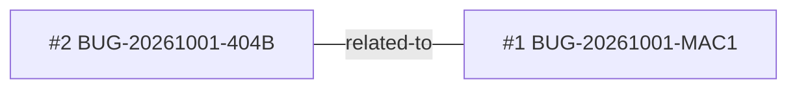

<!-- GENERATED, DO NOT EDIT: regenerado por /reversa-debugger-graph em 2026-10-01T20:37Z a partir de 2 bugs -->

# Grafo · compatibilidade-instalacao

Arestas tracejadas são relações `proposed` (hipótese); as `rejected` ficam só na matriz, como histórico.

## Impact score (heurística de triagem, não substitui priority/severity)

Nenhum bug aberto ou ativo neste contexto.

## Clusters

Ver arestas confirmadas acima.
