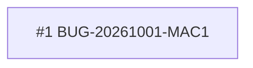

<!-- GENERATED, DO NOT EDIT: regenerado por /reversa-debugger-graph em 2026-10-01T17:05Z a partir de 2 bugs -->

# Grafo · compatibilidade-instalacao

Arestas tracejadas são relações `proposed` (hipótese).

## Impact score (heurística de triagem, não substitui priority/severity)

| bug | impact score |
|---|---|
| nenhum aberto | |

## Clusters

Nenhum cluster com arestas supported/confirmed neste contexto.
