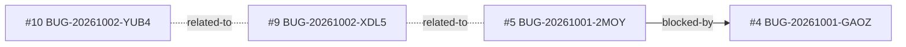

<!-- GENERATED, DO NOT EDIT: regenerado por /reversa-debugger-graph em 2026-10-02T15:36Z a partir de 4 bugs -->

# Grafo · integracao-whatsapp-web

Arestas tracejadas são relações `proposed` (hipótese); as `rejected` ficam só na matriz, como histórico.

## Impact score (heurística de triagem, não substitui priority/severity)

Só arestas `supported`/`confirmed` contam; relações `proposed` ficam fora.

| bug | impact score |
|---|---|
| BUG-20261002-XDL5 | 0 |
| BUG-20261002-YUB4 | 0 |

## Clusters

- 2 bugs abertos (BUG-20261002-XDL5, BUG-20261002-YUB4) convergem em `ponte-audio.ts`: indício de causa comum. Corrija BUG-20261002-XDL5 primeiro (P1, high).
