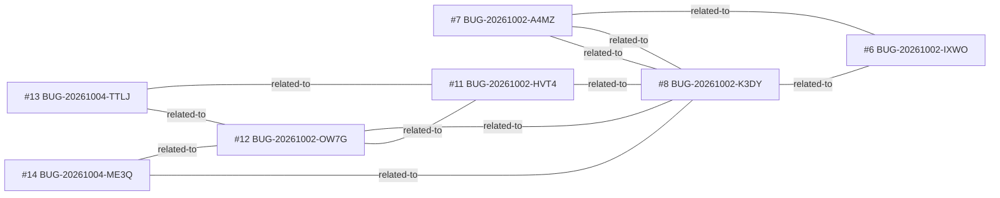

<!-- GENERATED, DO NOT EDIT: regenerado por /reversa-debugger-graph em 2026-10-04T21:10Z a partir de 7 bugs -->

# Grafo · janela-flutuante

Arestas tracejadas são relações `proposed` (hipótese); as `rejected` ficam só na matriz, como histórico.

## Impact score (heurística de triagem, não substitui priority/severity)

Só arestas `supported`/`confirmed` contam; relações `proposed` ficam fora.

Nenhum bug aberto neste contexto.

## Clusters

- 7 bugs (BUG-20261002-IXWO, BUG-20261002-A4MZ, BUG-20261002-K3DY, BUG-20261002-HVT4, BUG-20261002-OW7G, BUG-20261004-TTLJ, BUG-20261004-ME3Q) convergem em `gerenciador-janelas.ts` (7), `posicionador-colisoes.ts` (7), `janela-flutuante.css` (3): todos resolvidos e travados; um defeito novo nesses arquivos deve verificar primeiro `regression-of` contra eles.
