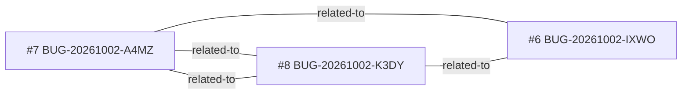

<!-- GENERATED, DO NOT EDIT: regenerado por /reversa-debugger-graph em 2026-10-02T21:14Z a partir de 3 bugs -->

# Grafo · janela-flutuante

Arestas tracejadas são relações `proposed` (hipótese); as `rejected` ficam só na matriz, como histórico.

## Impact score (heurística de triagem, não substitui priority/severity)

Nenhum bug aberto ou ativo neste contexto.

## Clusters

Nenhum arquivo afetado é compartilhado por dois ou mais bugs abertos.
